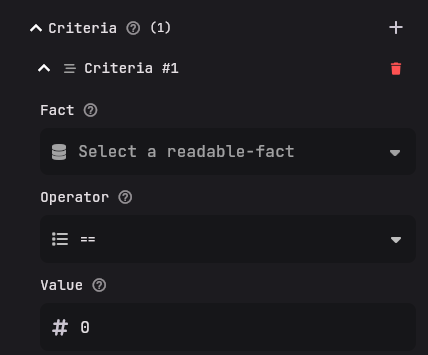
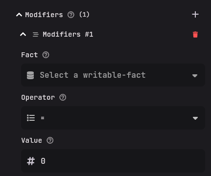

# Facts

Facts are essentially variables. They store information that can be modified by other entries. All facts are numbers and are treated as such.

:::info
Facts are stored per player, not for the server or world, unless otherwise specified.
:::

The [Basic Adapter](../adapters/BasicAdapter) has various types of facts to use.

## Why Use Facts?

Facts play a crucial role in dynamic content creation and system behavior customization. Here are some reasons to consider using facts:

- **Dynamic Quests:** Track player progress in quests by using facts to store and modify completion status.
  
- **Customization:** Personalize player experiences by utilizing facts to adjust in-game parameters, such as difficulty levels or character attributes.

- **Interactive Storytelling:** Enhance narrative elements by employing facts to remember player choices and actions, shaping the evolving story.

- **Achievement Systems:** Implement achievement tracking by using facts to record specific milestones and accomplishments.

## Types of Facts

Facts come in two base types: **Readable** and **Writable**.

- **Readable Facts:** Used in the criteria of an entry. For example, checking if a player has a certain item in their inventory.

- **Writable Facts:** Used in modifiers to modify the fact's value. For instance, updating a player's quest progression.

## Possibilities with Facts

### Gathering Items Quest

**Objective:** A player talks to an NPC and needs to gather items.

**Facts Used:**
- **Readable Fact:** Inventory Item Count Fact

**Scenario:**
1. Player talks to the NPC.
2. Criteria check using the Inventory Item Count Fact to verify if the player has the required items.

### Progression Tracking

**Objective:** Track a player's progression through different quest stages.

**Facts Used:**
- **Writable Fact:** Permanent Fact

**Scenario:**
1. Player talks to an NPC (Progression set to 1).
2. Completes a specific action (Progression set to 2).
3. Finishes the quest (Progression set to 3).

## Additional Examples

1. **Resource Gathering System:**
   - **Facts Used:** Writable Fact for resource count.
   - **Scenario:** Players gather resources, modifying the count with each collection.

2. **Time-Based Events:**
   - **Facts Used:** Readable Fact for the current in-game time.
   - **Scenario:** Implement events triggered by specific in-game times.

3. **Currency System:**
   - **Facts Used:** Writable Fact for player's currency balance.
   - **Scenario:** Players earn and spend currency, updating the balance accordingly.

## Step-by-Step Instruction

### Implementing a Permanent Fact for Progression Tracking

1. Navigate to the `static` panel and create a **Permanent Fact** named "QuestProgress" with an initial value of 0.

2. In the `triggers` panel, create an action.
   - Set a **Criteria:** Check if "QuestProgress" equals 0.
   - Set a **Modifier:** If criteria are met, update "QuestProgress" to 1.

3. Create additional actions to represent different quest stages, modifying "QuestProgress" accordingly.

## Use

To create a fact, navigate to the `static` panel of any page. The button is at the top right near the publish button.

Once you are there, press the + and create any type of fact you would like. You may fill out the parameters as you wish.

To use the fact in your entries, head back to the `triggers` panel and select an action. You should see these fields:

Press the + on either of them to create an instance of that field.

### Criteria

The criteria field allows you to set a condition for an action before it is run. If the condition is false, the action will not be run.

Select your fact and choose an operator and number to check the value of the fact with. If the condition is met, then the action will run.

### Modifiers

The modifiers' field allows you to modify facts.

:::caution
Modifying facts will only run if the entry is run. If the entry is not run, the fact will not be modified.

Hence, if the entry has criteria, and the criteria is false, the fact will not be modified.
:::

Select your fact and the operator to use with the fact. You can choose to change the value directly (=) or add to it (+).
